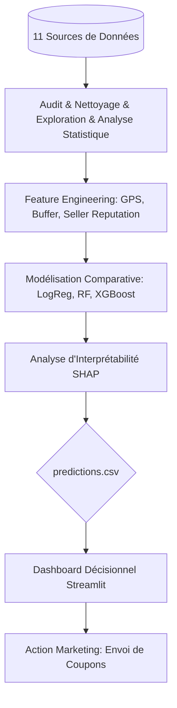

# Projet Data-Driven Decision Making - Olist Brazil

## Équipe
- **Hatim Brahim** 
- **Belhaj Hamza**

## Objectif du Projet
L'objectif est de prédire les retards de livraison dès la validation de la commande afin de réduire le taux de "Churn de satisfaction" (notes ≤ 2). Notre solution permet d'identifier les clients à haut risque pour déclencher des actions marketing proactives (envoi de coupons).

## Schéma d'Architecture (Pipeline Data-Driven)

## Structure du Projet
- `/data`: Données brutes et transformées (non suivies par Git)
- `/notebooks`: Analyses exploratoires et modèles
- `/docs`: Business Case, Data Story, Plan A/B Test et KPI Tree
- `/src`: Code source du Dashboard Streamlit

## Description des Fichiers et Structure
- notebooks/Brahim.ipynb : Pipeline technique complet. Audit, EDA, Tests statistiques, Modélisation (AUC 0.84) et SHAP.
- notebooks/Hamza.ipynb : Analyses business complémentaires et préparation des indicateurs.
- src/app.py : Code source de l'application interactive Streamlit.
- data/processed/predictions.csv : Export du modèle contenant les probabilités de risque et les facteurs explicatifs.
- data/processed/master.csv : Base de données fusionnée et nettoyée utilisée par le dashboard.
- docs/Phase1_Cadrage.md : Cadrage stratégique, définition des KPIs et Arbre de décision (KPI Tree).
- docs/AB_Test_Plan.md : Protocole expérimental complet (Z-test, puissance statistique) pour valider l'impact causal de l'intervention.
- docs/Data_Story.pdf : Présentation du projet Olist (réduction du churn par prédiction des retards).
- requirements.txt : Liste des dépendances Python pour la reproductibilité.

 ## Acquisition des Données
Pour faire fonctionner ce projet, vous devez :
1. Télécharger le dataset Olist sur Kaggle : [Lien Kaggle Olist](https://www.kaggle.com/datasets/olistbr/brazilian-ecommerce)
2. Télécharger les données IBGE : [Lien Kaggle IBGE](https://www.kaggle.com/datasets/gabrielrs3/economy-and-population-of-cities-in-brazil-ibge) 
3. Extraire et placer tous les fichiers `.csv` et `.xlsx` dans le dossier `data/raw/`.

## Installation & Utilisation
1. Cloner le dépôt : `git clone https://github.com/brahimhatim265/DATA-DRIVEN-DECISION-MAKING.git`
2. Créer un environnement virtuel : `python -m venv venv`
3. Activer l'environnement : `venv\Scripts\activate`
4. Installer les dépendances : `pip install -r requirements.txt`
5. Lancement du Dashboard : `streamlit run src/app.py`
   
