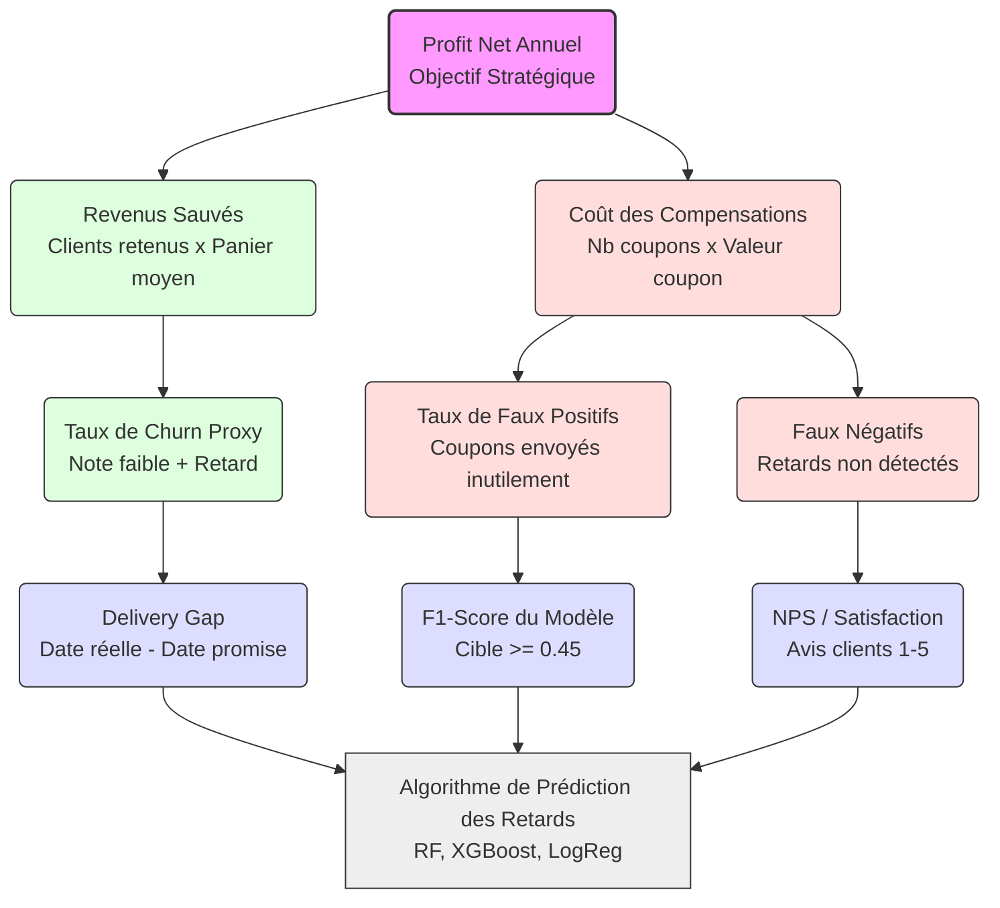

# Phase 1 : Définition du Problème & KPIs

## 1. Domaine Métier
**E-commerce & Logistique (Cas d'étude : Olist Brazil)**  
Olist est une marketplace brésilienne connectant des vendeurs à des clients. La gestion logistique est le pilier central de ce business : un retard de livraison impacte directement la réputation de la plateforme et la fidélité des utilisateurs.

## 2. Question Décisionnelle Centrale
> **"Comment prédire les retards de livraison en amont pour déclencher une action de compensation proactive, afin de minimiser le risque d'insatisfaction irrémédiable (Score review ≤ 2) ?"**

L'objectif est opérationnel : décider automatiquement quel client doit recevoir un geste commercial avant même qu'il ne reçoive un colis en retard.

## 3. Définition Stratégique du "Churn" (Proxy)
Sur une marketplace comme Olist, le churn classique est difficile à mesurer car 97% des clients sont mono-achat. 

**Notre définition du Churn (Proxy) :**
> "Un client est considéré comme 'churné' s'il donne une note ≤ 2 après avoir subi un retard de livraison, signalant une insatisfaction irrémédiable et une perte définitive de confiance envers la plateforme."

## 4. Indicateurs Clés de Performance (KPIs)

### A. KPI Business 
*   **Taux d'Insatisfaction Critique (Churn Proxy) :** Pourcentage de commandes avec retard + note ≤ 2.
*   **Objectif :Réduction de ce taux de **15% à 25%** via le système d'alerte.

### B. KPI Opérationnel (La fiabilité technique)
*   **AUC-ROC du modèle prédictif :** Cible ≥ 0,80 — métrique principale, robuste au déséquilibre de classes (8 % de retards).
*   **F1-Score (classe positive) :** Cible ≥ 0,45 — recalibrée empiriquement après expérimentation. La cible initiale de 0,75 s'est révélée intrinsèquement inatteignable sur ce type de problème (8 % de classe positive, features connues uniquement au moment de la commande) ; la littérature sur Olist plafonne entre 0,40 et 0,55. Ajuster la cible aux contraintes des données est précisément la démarche **data-driven** que ce projet récompense.
*   **Précision dans le Top-K% (métrique opérationnelle) :** Cible ≥ 50 % de précision dans le Top 5 % des commandes les plus risquées. C'est la métrique qui pilote réellement le ROI (cf. notebook `Hamza.ipynb`, section 2).

### C. KPIs de Suivi 
*   **NPS (Net Promoter Score) :** Note moyenne des avis clients.
*   **Average Delivery Gap :** Écart moyen (en jours) entre la date de livraison estimée et la date réelle.

## 5. KPI Tree (Arbre Hiérarchique)

    
## 6. Business Case & ROI Net Estimé (Détail financier)

*   **Hypothèses de base :**
    *   Volume annuel : 100 000 commandes.
    *   Taux de retards critiques : 10% (soit 10 000 clients à risque).
    *   Valeur future d'un client sauvé (LTV) : 150 BRL.
    *   Coût d'un coupon de compensation : 20 BRL.

*   **Calcul des Gains :** 
    En sauvant 20% des clients mécontents grâce à l'IA :  
    *2 000 clients sauvés × 150 BRL = **300 000 BRL***.

*   **Calcul des Coûts liés aux erreurs de l'IA (Faux Positifs) :** 
    Si le modèle prédit un retard à tort pour 15% des commandes saines, nous envoyons 1 500 coupons inutilement :  
    *1 500 coupons × 20 BRL = **30 000 BRL***.

*   **ROI NET ATTENDU :**  
    **300 000 BRL (Gains) - 30 000 BRL (Pertes IA) = + 270 000 BRL / an.**