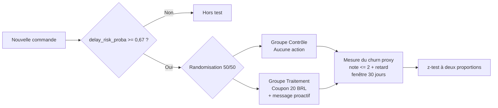

# Phase 6 : Plan A/B Test — Intervention proactive par coupon

## 1. Contexte et objectif

Notre modèle de prédiction des retards attribue à chaque nouvelle commande une probabilité `delay_risk_proba`. La décision opérationnelle évaluée par ce test : **envoyer un coupon d'excuse proactif de 20 BRL aux commandes classées à risque, dès la passation de la commande**, pour réduire la perte de clients (churn proxy : note ≤ 2 après retard).

L'objectif est de **mesurer rigoureusement l'effet causal de cette intervention** sur le churn proxy, et non de se contenter d'une estimation théorique.

## 2. Hypothèses

- **H0 (nulle)** : l'envoi proactif d'un coupon aux commandes à risque ne change PAS le taux de churn proxy.  
  *taux_churn(traitement) = taux_churn(contrôle).*
- **H1 (alternative)** : l'envoi proactif réduit le taux de churn proxy.  
  *taux_churn(traitement) < taux_churn(contrôle).*

**Cible business** : réduction relative du churn proxy de **15 % à 25 %** parmi les commandes ciblées.

## 3. Population et randomisation

- **Population éligible** : toutes les nouvelles commandes dont `delay_risk_proba ≥ 0,67`. Ce seuil correspond au point de rentabilité individuel de l'intervention : pour une commande de risque 0,67, le gain attendu (`0,67 × 0,20 × 150 ≈ 20,1 BRL`) dépasse tout juste le coût du coupon (20 BRL). En-dessous, l'intervention détruit de la valeur.
- **Allocation aléatoire 50/50** au niveau de la commande, via un hash déterministe de l'`order_id` (reproductible, sans biais d'allocation).
- **Groupes** :
  - **Contrôle** : aucune action (statu quo).
  - **Traitement** : coupon d'excuse de 20 BRL envoyé immédiatement + message d'ajustement de la promesse de livraison.

## 4. Métriques

- **Métrique principale** : taux de churn proxy = part des commandes avec retard ET note ≤ 2.  
  *Fenêtre de mesure : 30 jours après la date de livraison estimée.*
- **Métriques secondaires** :
  - Note moyenne de l'avis client (échelle 1–5).
  - Taux de ré-achat à 90 jours.
  - Delivery gap moyen (date réelle − date estimée), pour vérifier que les retards eux-mêmes ne sont pas affectés par l'intervention.
- **Garde-fous (guardrails)** :
  - Coût total des coupons ≤ revenu LTV récupéré (rentabilité globale du test).
  - Pas d'augmentation > 10 % des plaintes service client.

## 5. Taille d'échantillon (calcul de puissance)

**Hypothèses du calcul** (calibrées sur les vraies prédictions du modèle, fichier `data/processed/predictions.csv`) :
- Taux de churn proxy baseline (groupe contrôle) parmi les commandes high-risk au seuil 0,67 : **51,3 %**. Mesuré empiriquement sur le test set : 51,3 % des commandes flaguées high-risk présentent à la fois un retard et une note ≤ 2, ce qui valide la pertinence du ciblage du modèle.
- Effet minimum détectable (MDE) : **20 % relatif** (centre de la cible 15–25 %) — on cherche à détecter une baisse de 51,3 % → 41,0 % (soit −10,3 points).
- α = 0,05 (bilatéral), puissance = 80 %.
- Test : z-test à deux proportions.

**Résultat** :

$$n_{\text{par groupe}} = \frac{(z_{\alpha/2} + z_{\beta})^2 \cdot (p_1(1-p_1) + p_2(1-p_2))}{(p_1 - p_2)^2} \approx 364$$

Soit **environ 728 commandes au total**. On retient une cible opérationnelle de **500 par groupe (~1 000 au total)** pour absorber les pertes (commandes annulées, données manquantes). C'est sensiblement moins que l'estimation initiale (qui supposait un baseline de 30 %) : un baseline réel plus élevé rend l'effet plus facile à détecter, donc moins d'échantillons nécessaires.

## 6. Durée du test

Avec un volume Olist d'environ 100 000 commandes/an (~275/jour) et le **taux réel de high-risk mesuré à 3,3 %** (sur le test set, au seuil 0,67), on a environ **9 commandes éligibles par jour**. Pour atteindre 1 000 randomisations :

- **Durée estimée : ~111 jours, soit environ 16 semaines (4 mois).**
- Le pool high-risk est plus sparse qu'estimé initialement (10–15 %) car le modèle est très conservateur au seuil 0,67. Pour accélérer le test, deux leviers possibles : baisser le seuil à 0,5 (~6 % du volume, mais on perd en précision), ou élargir géographiquement le test.

## 7. Règle de décision

À la fin de la période :
- **Rejet de H0 si** : p-value < 0,05 **ET** baisse observée du churn proxy ≥ 15 % en relatif (cible business basse) **ET** économies nettes > 0 (selon LTV 150 / coupon 20).
- **Si H0 rejetée** → déploiement du programme à toutes les commandes high-risk.
- **Si H0 non rejetée** → itération sur les leviers : montant du coupon, contenu du message, ou seuil de risque.

## 8. Risques et biais

- **Spillover** : faible (commandes indépendantes, pas d'effet réseau entre clients).
- **Saisonnalité** : neutralisée par la randomisation 50/50 dans la même fenêtre temporelle (les deux groupes subissent les mêmes jours fériés).
- **Effet Hawthorne** : improbable car l'intervention est silencieuse côté client (réception d'un coupon, pas d'avis d'expérimentation).
- **P-hacking** : pré-enregistrement obligatoire du plan d'analyse avant le démarrage (métrique principale, seuil de significativité, durée). Pas d'analyses intermédiaires non planifiées.

## 9. Prochaines étapes

1. ✅ ~~Finaliser les métriques (Precision / Recall / F1) du modèle gagnant et le taux réel de commandes high-risk.~~ **Fait** : AUC = 0,846, F1 = 0,46, Précision Top 5 % = 56,2 %, taux high-risk = 3,3 %.
2. ✅ ~~Recalibrer la baseline de churn proxy et la taille d'échantillon.~~ **Fait** : baseline mesurée à 51,3 %, taille d'échantillon recalculée à 364 par groupe.
3. Implémenter le code de randomisation dans `src/randomizer.py` (hash déterministe d'`order_id`).
4. Coordonner avec l'équipe Marketing pour le canal d'envoi du coupon.
5. Pré-enregistrer le plan d'analyse, puis lancer le test.